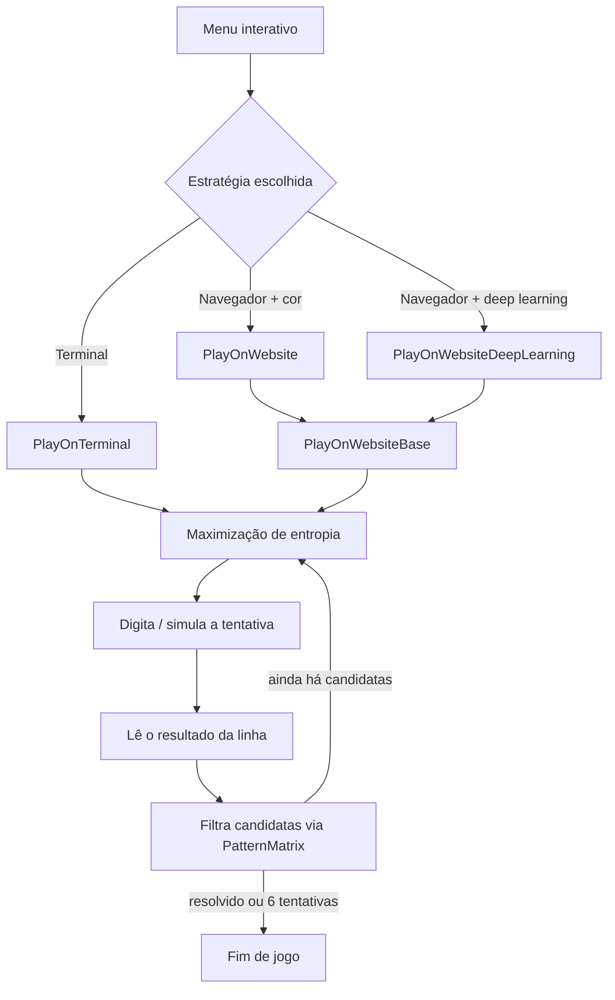

# Termo Solver

Um solucionador automático do [Termo](https://term.ooo/) (o Wordle brasileiro) que combina **teoria da informação**, **deep learning** e **visão computacional** para escolher cada palavra de forma ótima — sem depender de tentativa e erro.


## Sobre o projeto

Em vez de chutar palavras "prováveis", o solver formaliza o problema como uma questão de **teoria da informação**: a cada tentativa, qual palavra reduz mais, em expectativa, a incerteza sobre a resposta correta? Essa mesma pergunta é a base teórica do problema clássico das "20 perguntas" e do conceito de entropia de Shannon — aqui aplicada a um jogo de palavras.

O tabuleiro pode ser lido de duas formas: por análise direta de cor, ou por uma **rede neural convolucional** treinada para essa classificação, com decisões de arquitetura pensadas especificamente para um dataset pequeno (regularização via `GlobalAveragePooling2D`, data augmentation, early stopping). A automação em si (Playwright + OpenCV), a organização do código (padrões Strategy e Template Method), a memoização do espaço de padrões de resultado e um notebook de análise exploratória para comparar estratégias completam um projeto que atravessa algoritmos, aprendizado de máquina, engenharia de software e análise de dados.

## Fundamentação teórica

### Teoria da informação: escolha de palavras por maximização de entropia

A cada tentativa, o solver calcula, para cada palavra candidata, a **entropia de Shannon** da distribuição de resultados que ela produziria contra o conjunto de palavras ainda possíveis:

$$H(g) = -\sum_{r} P(r) \log_2 P(r)$$

onde $r$ é um dos possíveis padrões de resultado (combinações de "correto"/"presente"/"ausente" nas 5 posições) e $P(r)$ é a fração das palavras candidatas que produziriam esse padrão específico se `g` fosse a tentativa.

Uma palavra com entropia alta divide o espaço de possibilidades em muitos grupos de tamanho equilibrado — ou seja, qualquer que seja a resposta do jogo, ela elimina uma fração grande das candidatas. O solver escolhe, a cada rodada, a palavra de maior entropia entre as ainda não tentadas; quando restam poucas candidatas, o cálculo deixa de compensar e a escolha passa a ser aleatória entre elas. É a mesma abordagem popularizada por Grant Sanderson (3Blue1Brown) para o Wordle em inglês, adaptada aqui para o dicionário e o ranking estático de um vocabulário próprio.

### Otimização algorítmica: memoização do espaço de padrões

O cálculo de entropia e a filtragem de candidatas dependem do resultado de comparar cada par (resposta, palpite) contra as regras do jogo — e esse resultado nunca muda entre partidas, já que depende só das duas palavras envolvidas. A classe `PatternMatrix` pré-calcula essa comparação para **todos** os pares do dicionário (~2 milhões, para as ~1.443 palavras do vocabulário) uma única vez, e reaproveita o resultado via cache em disco entre execuções — a troca clássica de espaço por tempo por trás de memoização. Isso evita refazer o mesmo cálculo a cada tentativa de cada partida simulada, o que importa especialmente ao gerar datasets (até 6 tentativas × todas as palavras do dicionário).

Uma otimização adicional sobre essa mesma estrutura: cada padrão de resultado (5 posições, 3 estados possíveis cada) é codificado como um único inteiro em base 3 em vez de armazenado como tupla — reduziu o cache de ~38MB para ~15MB e o tempo de carregamento em mais de 2×.

### Deep learning: arquitetura pensada para um dataset pequeno

A leitura do tabuleiro via rede neural não foi tratada como "empilhar camadas", mas como uma série de decisões deliberadas:

- **`GlobalAveragePooling2D` no lugar de `Flatten` + `Dense`**: a abordagem tradicional achata o mapa de ativação inteiro (altura × largura × canais) antes da camada densa, gerando um número de parâmetros proporcional à resolução da imagem — nesse projeto, isso concentrava a maior parte dos ~123 mil parâmetros do modelo em uma única camada. Global Average Pooling, técnica introduzida por Lin, Chen & Yan em *Network In Network* (2013) e popularizada pela GoogLeNet, substitui isso por uma média por canal, reforçando a correspondência entre mapas de ativação e classes e atuando como regularizador estrutural — reduzindo essa camada para ~150 parâmetros sem perda de acurácia relevante para a tarefa.
- **Data augmentation geométrica** (`RandomRotation`, `RandomTranslation`, `RandomZoom`) para compensar um dataset de poucas dezenas de imagens, aumentando a variabilidade efetiva vista pelo modelo a cada época sem coletar dado novo.
- **Early stopping monitorando `val_loss`** como regularização implícita — interrompe o treino quando o modelo para de melhorar de verdade, em vez de depender de um número fixo (e arbitrário) de épocas. Monitorar `val_accuracy` em vez de `val_loss` chegou a mascarar aprendizado real: com um conjunto de validação pequeno, a acurácia só assume valores quantizados e "trava" em um deles por várias épocas mesmo com o modelo melhorando de verdade por baixo.
- **Reamostragem por área (`interpolation="area"`)** ao reduzir a resolução de entrada, evitando aliasing — escolha justificada empiricamente: a cor de fundo dominante do tabuleiro permanece identificável mesmo em baixa resolução, o que permitiu reduzir a entrada de 61×61 para 32×32 sem comprometer o sinal relevante para a classificação.

### Engenharia de software: arquitetura extensível

| Padrão | Onde | Por quê |
|---|---|---|
| **Strategy** | `SolutionStrategy` / `Context` | Troca o modo de jogo (terminal, navegador, deep learning) sem alterar quem o utiliza |
| **Template Method** | `PlayOnWebsiteBase` | Compartilha toda a orquestração do navegador entre as duas estratégias que o usam; só a leitura do resultado (`_read_row`) muda |
| **Lazy Initialization** | `compvision._get_model` / `player._get_pattern_matrix` | TensorFlow e a matriz de padrões só são carregados na primeira vez que são necessários, e reaproveitados pelo resto da sessão |
| **Memoization** | `player.PatternMatrix` | Pré-calcula e cacheia em disco o resultado de todas as comparações palavra × palavra, evitando recomputação entre partidas |

### Metodologia: validação por regressão, não por inspeção visual

Mudanças no algoritmo foram validadas comparando, com semente aleatória fixa, o resultado de centenas de partidas simuladas antes e depois de cada alteração — não só "rodou sem erro". Essa disciplina revelou bugs que passariam despercebidos numa inspeção manual: um deles fazia o programa continuar "tentando" a palavra já correta até esgotar as tentativas em vez de encerrar a partida; outro, presente desde a primeira versão do projeto, fazia o espaço de busca colapsar silenciosamente sempre que uma palavra inicial era especificada — só veio à tona ao testar sistematicamente esse caminho, nunca exercitado antes.

## Competências técnicas demonstradas

- Aplicação de teoria da informação (entropia de Shannon) para otimização de estratégia de busca
- Memoização e compressão de estruturas de cache para otimização de desempenho
- Design, treino e regularização de CNNs para classificação de imagens com dataset limitado
- Pipeline de visão computacional (OpenCV) como alternativa não paramétrica ao modelo de deep learning
- Padrões de projeto (Strategy, Template Method) aplicados a um problema real de arquitetura extensível
- Automação de navegador (Playwright) integrada a um pipeline de inferência de ML
- Validação por testes de regressão, incluindo a identificação de um bug pré-existente não coberto pela bateria de testes anterior
- Análise exploratória de dados (pandas, seaborn) para comparar estratégias com base em dados simulados, não intuição

## Como funciona



## Estrutura do projeto

```
termo/
├── data/
│   ├── data.csv                    # dicionário de palavras + ranking estático
│   ├── dataset_{palavra_inicial}.csv  # gerados pelo modo "gerar dataset" (um por palavra inicial usada)
│   ├── pattern_matrix.joblib        # cache da matriz de padrões pré-computada (gerado automaticamente)
│   └── images/                      # imagens de treino do modelo (amarelo/preto/verde)
├── src/
│   ├── play.py                      # ponto de entrada: menu interativo
│   ├── player.py                    # estratégias, algoritmo de escolha de palavras, PatternMatrix
│   ├── compvision.py                # automação de navegador, leitura do tabuleiro
│   ├── model.ipynb                  # treino do modelo de deep learning
│   └── eda_datasets.ipynb           # análise exploratória e comparação dos datasets gerados
└── README.md
```

## Instalação e uso

```bash
git clone <url-do-repositorio>
cd termo/src

pip install -r requirements.txt
playwright install chromium

python play.py
```

O menu interativo pergunta a palavra inicial (opcional) e a palavra correta (obrigatória no modo terminal; opcional nos modos de navegador — deixe em branco para jogar contra a palavra real do dia). A primeira execução demora alguns segundos a mais para construir o cache de padrões (`pattern_matrix.joblib`); as seguintes reaproveitam esse arquivo.

## Análise exploratória

`eda_datasets.ipynb` traz um menu interativo (no próprio notebook) para navegar entre os datasets gerados e comparar diferentes palavras iniciais entre si — taxa de vitória, distribuição do número de tentativas e quais segundas tentativas o algoritmo mais escolhe — permitindo decidir com dados, e não achismo, qual abertura performa melhor em média.

## Limitações conhecidas

- A automação de navegador depende de coordenadas de pixel fixas e da estrutura atual da página do site — mudanças visuais podem quebrar a captura do tabuleiro.
- O dataset de treino do modelo é pequeno (poucas dezenas de imagens), o que limita a confiabilidade da estratégia de deep learning frente à alternativa não paramétrica (`check_collors`).

## Referências

- Shannon, C. E. (1948). *A Mathematical Theory of Communication*.
- Lin, M., Chen, Q., & Yan, S. (2013). *Network In Network*.
- Sanderson, G. (3Blue1Brown). *Solving Wordle using information theory*.

## Licença

Distribuído sob a licença MIT. Veja `LICENSE` para mais detalhes.
